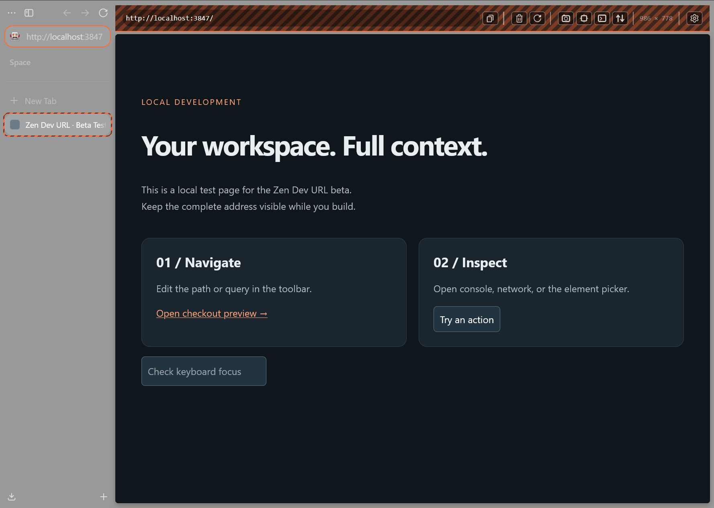
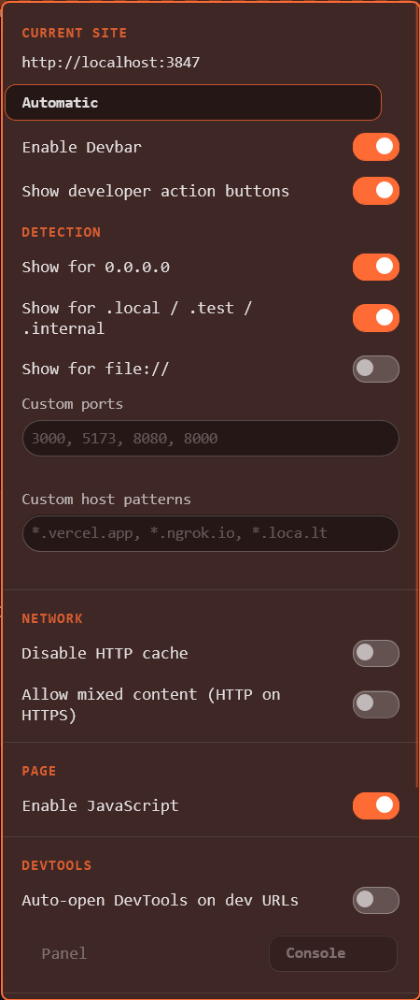

# devbar

**Keep the full URL and developer tools in view while you build in Zen.**

An Arc-inspired toolbar that appears on localhost and other development sites. Edit the address, open DevTools, and remember which sites should show the bar.

Created and maintained by [DannyAmzq](https://github.com/DannyAmzq).

[Get started](docs/INSTALLATION.md) · [Releases](https://github.com/DannyAmzq/zen-dev-url/releases) · [Report a bug](https://github.com/DannyAmzq/zen-dev-url/issues/new?template=bug_report.md)

## Why use it?

- **See and edit the full address**, including paths, ports, and query parameters, with native Zen suggestions.
- **Remember each site:** Automatic, Always on, or Always off. Different ports and schemes keep separate choices.
- **Reach developer tools quickly:** inspector, console, network, screenshots, and reload bypassing cache.
- **Keep context visible:** a live viewport readout and a striped tab indicator identify the active development page.
- **Keep it simple:** hide the extra action buttons when you only need the URL.

## Try the beta

**1.2.0-beta.1** has been tested on **Windows 11 with Zen 1.22.1b**, including installation, removal, restart, and split-pane behavior. Live macOS/Linux and Sine testing remains open. [See the validation record](docs/BETA-VALIDATION.md).

1. [Download the source ZIP](https://github.com/DannyAmzq/zen-dev-url/archive/refs/heads/main.zip) and extract it, or choose a published beta from [Releases](https://github.com/DannyAmzq/zen-dev-url/releases). If no beta is listed yet, use the source ZIP.
2. Follow the [installation guide](docs/INSTALLATION.md) for your platform and chosen Zen profile, then restart Zen.
3. Open a local app such as `http://localhost:3000`. The toolbar appears automatically. To enable it on staging, open settings and choose **Always on**.

devbar uses the bundled **fx-autoconfig** loader and privileged userChrome JavaScript. It is installed separately from the Zen Mods store. Try it in a separate profile first.

## Shortcuts and site settings

| Shortcut | Action |
| --- | --- |
| `Alt+Shift+D` | Toggle the toolbar for this site and remember the choice |
| `Alt+Shift+O` | Open settings, even when the toolbar is hidden |
| `Enter` / `Escape` in the URL field | Navigate / cancel editing |

On macOS, Alt is Option. Remembered choices apply to HTTP(S) origins; other pages use a temporary tab toggle.

See the current settings panel

The panel scrolls to reveal more developer settings and actions. [Configuration and controls](docs/CONFIGURATION.md).

## Help and feedback

[Installation, updates, and removal](docs/INSTALLATION.md) · [Configuration](docs/CONFIGURATION.md) · [Troubleshooting](docs/INSTALLATION.md#troubleshooting) · [Changelog](CHANGELOG.md)

For this beta, try your usual localhost and staging workflow, restart Zen, and tell us whether you kept the bar enabled. [Ten-minute test guide](docs/BETA-TESTING.md).

[Report issues here](https://github.com/DannyAmzq/zen-dev-url/issues) with your Zen version, OS, and reproduction steps. Remove private URLs and tokens from screenshots. Contributions go to `dev`; see [Contributing](CONTRIBUTING.md) and [Security](SECURITY.md).
